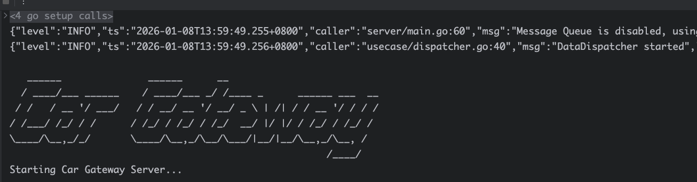
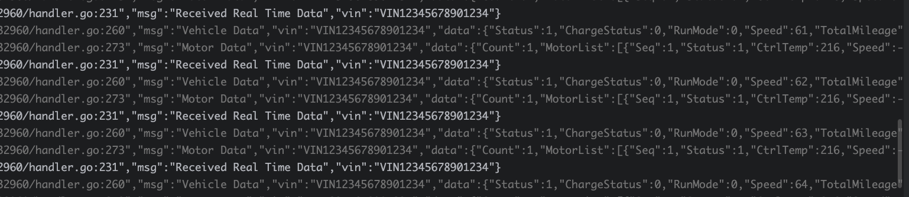

# Car Gateway (高性能车辆网关)


**Car Gateway** 是一个基于 Go 语言开发的高性能车辆网关，实现了 **GB/T 32960** 国标协议接入。它专为海量车辆并发连接设计，支持将数据实时转发到消息队列（RabbitMQ, Kafka），是车联网平台的理想入口组件。
## 🌟 核心特性 (Features)

- **🚀 极致性能**: 基于 `gnet` 网络库构建，采用非阻塞 I/O 模型，轻松应对数万级车辆并发连接。
- **🔄 双协议支持**: 同时支持 **GB/T 32960-2016** 和 **GB/T 32960-2025** 标准，能够自动识别并处理不同版本的车辆报文。
- **🔌 灵活的消息队列**:
    - **多适配**: 内置 RabbitMQ 和 Kafka 支持。
    - **可配置**: 通过配置文件一键切换 MQ 类型，或完全关闭 MQ 进行本地调试。
- **🛡️ 安全可靠**: 代码层剥离敏感配置，支持生产环境安全部署。
- **� 极其轻量**: 核心代码精简，编译后二进制文件体积 **< 7MB**，运行时内存占用极低，完美适配容器化部署及边缘计算场景。
- **�🔌 易于扩展**: 模块化设计，鉴权、数据分发、协议解析高度解耦，方便二次开发。

## 📸 运行演示 (Screenshots)

### 🚀 启动画面


### 📊 压测效果
*(此处可添加压测或其他监控图)*


## 🛠️ 快速开始 (Getting Started)

### 前置要求

- Go 1.20+
- RabbitMQ 或 Kafka (可选)

### 安装步骤

1.  克隆项目，配置文件:
   复制 `configs/config.yaml` 并根据环境修改。
   *注意: 默认配置中包含此项目的敏感信息占位符，生产环境请替换为真实值。*
   ```yaml
   message_queue:
     enabled: true        # 是否开启 MQ 推送
     type: "rabbitmq"     # 选项: "rabbitmq" 或 "kafka"
   ```

2. 启动服务:
   ```bash
   go run cmd/server/main.go
   ```
   启动成功后，你将看到 **Car Gateway Server** 的启动 Banner。

## ⚙️ 配置说明

| 配置项 | 说明 | 默认值 |
| --- | --- | --- |
| `server.port` | TCP 监听端口 | `32960` |
| `message_queue.type` | 消息队列类型 | `rabbitmq` |
| `message_queue.enabled` | 开启/关闭 MQ 推送 | `true` |
| `message_queue.rabbitmq` | RabbitMQ 连接配置 | - |
| `message_queue.kafka` | Kafka 连接配置 | - |

## 📂 项目结构 (Project Structure)

```text
.
├── cmd
│   └── server
│       └── main.go           # 程序启动入口 (Entrypoint)
├── configs
│   └── config.yaml           # 配置文件 (Configuration)
├── internal
│   ├── config                # 配置结构体定义
│   ├── infra                 # 基础设施层 (Infrastructure)
│   │   ├── kafka             # Kafka 生产者实现
│   │   ├── mq                # MQ 通用接口定义
│   │   └── rabbitmq          # RabbitMQ 生产者实现
│   ├── protocol              # 协议解析层 (Protocol Layer)
│   │   └── gbt32960          # GB/T 32960 报文解析核心逻辑
│   ├── server                # 接入层 (Server Layer)
│   │   └── tcp_server.go     # 基于 gnet 的 TCP 服务实现
│   └── usecase               # 业务逻辑层 (UseCase Layer)
│       ├── gbt32960          # 业务处理 (Handler, Session, Auth)
│       └── dispatcher.go     # 数据分发器 (Worker Pool)
├── go.mod                    # 依赖管理
└── README.md                 # 项目说明文档
```

## 🏗️ 核心架构解析 (Architecture Deep Dive)

本项目采用清晰的分层架构设计，各层职责单一，便于维护和扩展。

### 1. 接入层 (Server Layer)
- **路径**: `internal/server`
- **核心组件**: `TCPServer`
- **作用**: 基于 `gnet` 高性能网络库实现 TCP 监听。负责底层字节流的读取、连接生命周期管理（Accept/Close）。它不处理具体业务，仅将读取到的完整数据包传递给上层处理器。

### 2. 协议层 (Protocol Layer)
- **路径**: `internal/protocol`
- **核心组件**: `Packet`, `Parser`, `Serializer`
- **作用**: 严格遵循 GB/T 32960 标准（2016/2025 兼容）。
    - **Header 解析**: 识别 `##` (2016) 或 `$$` (2025) 起始符，解析 VIN、加密位等。
    - **Body 解析**: 根据命令字（如车辆登入 0x01, 实时数据 0x02）解析具体数据单元。支持扩展数据类型（如电池电压、温度、极值数据等）的自动解包。

### 3. 业务逻辑层 (UseCase Layer)
- **路径**: `internal/usecase`
- **核心组件**:
    - **Handler**: 业务流程控制器。接收协议层解析后的 `Packet`，执行登录鉴权、心跳保活、数据转发等逻辑。
    - **SessionManager**: 会话管理器。维护 `VIN` 到 `Connection` 的映射，处理连接超时踢出机制。
    - **DataDispatcher**: 数据分发器。采用 Worker Pool 模式，异步将解包后的车辆数据投递到消息队列，避免阻塞网络 I/O。

### 4. 基础设施层 (Infrastructure Layer)
- **路径**: `internal/infra`
- **核心组件**: `mq.Producer` (RabbitMQ/Kafka)
- **作用**: 屏蔽底层中间件差异。
    - 提供统一的 `Producer` 接口。
    - `kafka`: 基于 `segmentio/kafka-go` 实现高性能数据写入。
    - `rabbitmq`: 实现 Exchange/Queue 的声明与绑定，支持断线重连。

### 5. 启动入口 (Entrypoint)
- **路径**: `cmd/server/main.go`
- **作用**: 程序的胶水层。负责加载 `configs/config.yaml`，初始化 Logger、MQ Producer、SessionManager，并将它们组装注入到 `TCPServer` 中启动服务。 
## 🤝 贡献

欢迎提交 Issue 和 Pull Request 来改进 Car Gateway！
